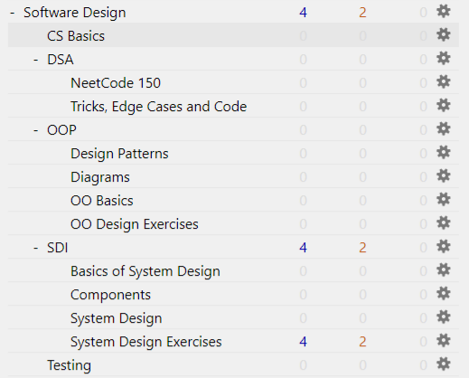

**Achieve mastery in software design using Anki flashcards.**
**Includes Data-structures and Algorithms, System Design, Object Oriented Programming, Design patterns, etc.**

⚠️These notes are work in progress!!!⚠️

# How to use:

1. Install Anki from [Anki](https://apps.ankiweb.net/).
2. Import this deck: File>Import

# Motivation

To master a subject you need to do _deliberate practice_.
Anki's implementation of [spaced repetition](https://www.gwern.net/Spaced-repetition) and [active recall](https://en.wikipedia.org/wiki/Testing_effect) creates a great env for _deliberate practice_.
The goal therefore is to create the best resource for mastering software design using Anki.

---

This deck inspired by the following sources:

1. https://github.com/donnemartin/system-design-primer
2. https://www.gwern.net/Spaced-repetition
